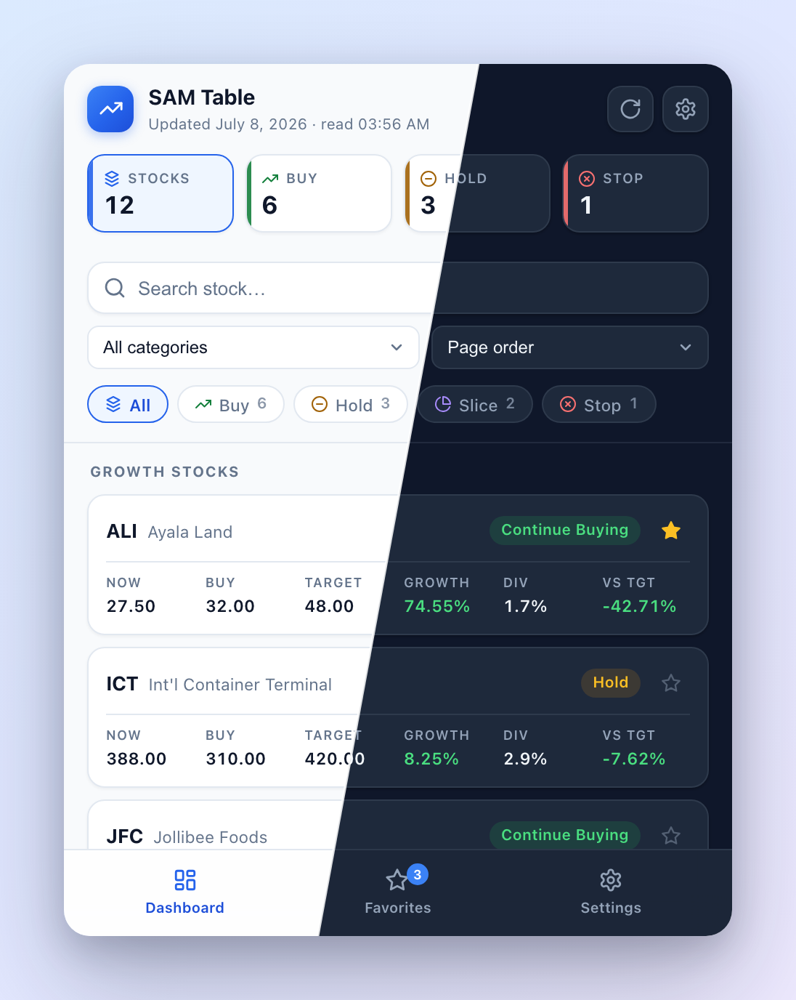
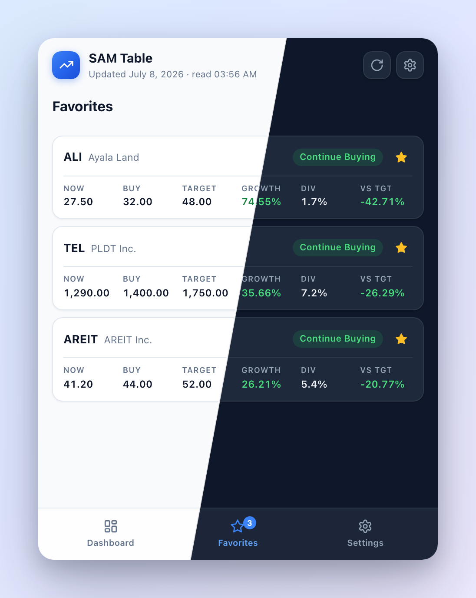
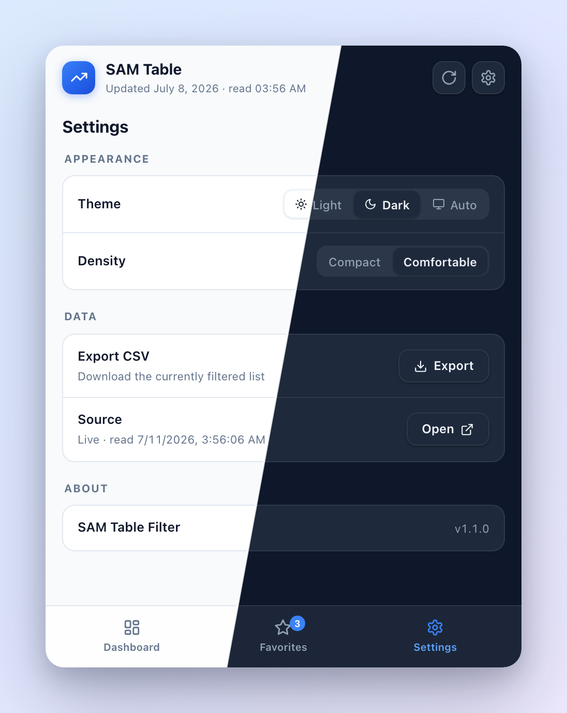
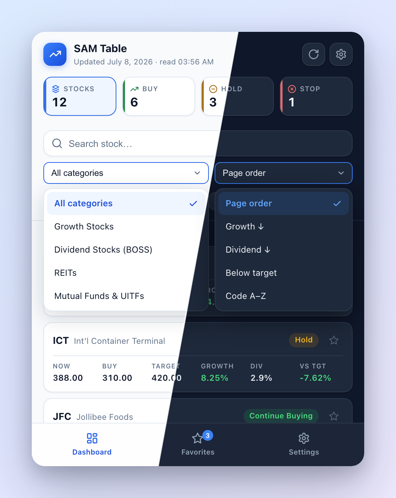

# SAM Table Filter

An **unofficial** browser extension for [Truly Rich Club](https://trulyrichclub.com) members. It puts the club's **SAM (Strategic Averaging Method) Table** — the list of stock recommendations for Philippine Stock Exchange investors — one click away in your browser toolbar, with filtering, sorting, search, and CSV export that the members' site doesn't offer.

> **Disclaimer:** This project is not affiliated with, endorsed by, or connected to Truly Rich Club or Bo Sanchez. It is a personal convenience tool. **You need your own active TRC membership** — the extension only shows data your own login can already access, and no data ever leaves your browser. Nothing in this repository contains club content.

<p align="center">
  
  
  
  
</p>

*Each preview is split diagonally — light theme on the left, dark theme on the right. Screenshots use mock data: tickers and figures are invented, not actual SAM Table content.*

## What it does

- Lists every SAM Table recommendation in a compact popup, grouped by category (Growth Stocks, Mature Dividend Stocks, REITs, funds, …)
- Filter by **action** — Continue Buying, Hold, Stop Buying, Top-slice if Green — with one-tap color-coded chips
- Filter by **category**, full-text **search** by stock code or fund name
- **Sort** by expected growth, dividend yield, distance below target price, or code
- Per-stock stats at a glance: current price, buy-below, target, expected growth, dividend yield, % from target — tap a card for a **detail view** with copy-ticker and quick links
- **Quick stats cards** (Stocks / Buy / Hold / Stop) that double as one-tap filters
- **Favorites** — star stocks to pin them to their own tab
- **Light, dark, and system themes**, plus compact/comfortable list density
- **CSV export** of whatever is currently filtered
- Works from any tab: fetches the SAM page in the background using your existing logged-in session — no password stored, ever
- Falls back to a cached snapshot when offline or logged out, with a clear "cached data" banner so you always know what you're looking at

## Installation

### Chrome / Edge / Brave

1. Download this repository (**Code → Download ZIP**) and unzip it, or `git clone` it.
2. Open `chrome://extensions` (`edge://extensions` on Edge).
3. Turn on **Developer mode** (top right).
4. Click **Load unpacked** and select the project folder.

### Firefox

Release Firefox only permanently installs Mozilla-signed extensions, so pick one:

**A. Temporary load** (quickest; removed when Firefox restarts)
1. Go to `about:debugging#/runtime/this-firefox`
2. Click **Load Temporary Add-on…** and select `manifest.json` inside the project folder.

**B. Permanent — Firefox Developer Edition or ESR**
1. Install [Firefox Developer Edition](https://www.mozilla.org/firefox/developer/) or ESR.
2. In `about:config`, set `xpinstall.signatures.required` to `false`.
3. Zip the *contents* of the folder (`manifest.json` must be at the zip root), rename it to `.xpi`, and open it in Firefox.

**C. Permanent — free self-signing via Mozilla**
1. Create an account at [addons.mozilla.org](https://addons.mozilla.org).
2. Submit the zip under **Submit a New Add-on → On your own** (self-distribution).
3. Mozilla auto-signs it in minutes; install the signed `.xpi` in any Firefox.

> **Firefox permission note:** Firefox treats host permissions as opt-in. After installing, open `about:addons` → SAM Table Filter → **Permissions** and enable access for `members.trulyrichclub.com`, or the background fetch will be blocked.

## Usage

1. Log in to `members.trulyrichclub.com` once, normally, in any tab.
2. Click the extension icon from **any** tab — it fetches and parses the SAM Table automatically.
3. Filter with the action chips (combine several), pick a category, search, or sort.
4. **CSV** exports the currently filtered list. **Refresh** re-fetches on demand.

## How it works

When the popup opens (or Refresh is clicked) it tries, in order:

1. **Live page** — if the SAM page is your active tab, it reads the rendered tables directly via a content script.
2. **Background fetch** — otherwise it requests the SAM page with your browser's session cookie (`credentials: include`) and parses the returned HTML. Your password is never stored or seen.
3. **Hidden-tab render** — if the fetched HTML has no tables (the site builds them with JavaScript), it opens the page in a background tab, waits for the scripts to render, scrapes, and closes the tab.
4. **Cache** — if all of that fails (offline, logged out), it shows the last successful snapshot from `chrome.storage.local`, with an amber banner telling you the data is cached and why.

The header always shows when the club last updated the table and when the extension last read it.

## Privacy

- No analytics, no external requests other than to the TRC members' site itself.
- No credentials stored. The extension uses the same session your browser already has.
- All parsing happens locally; the only stored artifact is the last scrape, kept in your browser's local extension storage.

## Development

| File | Purpose |
| ---- | ------- |
| `manifest.json` | MV3 manifest (Chrome + Firefox via `browser_specific_settings`) |
| `popup.html` / `popup.css` / `popup.js` | The toolbar popup UI and data flow |
| `parser.js` | Shared table-parsing logic (used by both the popup and the content script) |
| `content.js` | Content script that answers scrape requests on the SAM page |

The scraper is intentionally generic: it picks up any table with a `Stocks`/`Code` column and an `Action` column and uses the nearest heading above it as the category. If the site's markup changes, adjust the regexes in `parser.js` (`headerMap`).

Build a distributable zip (manifest at the root, as browsers require):

```sh
zip -r sam-table-filter.zip manifest.json popup.html popup.css popup.js parser.js content.js icons -x "*.DS_Store"
```

## License

[MIT](LICENSE)